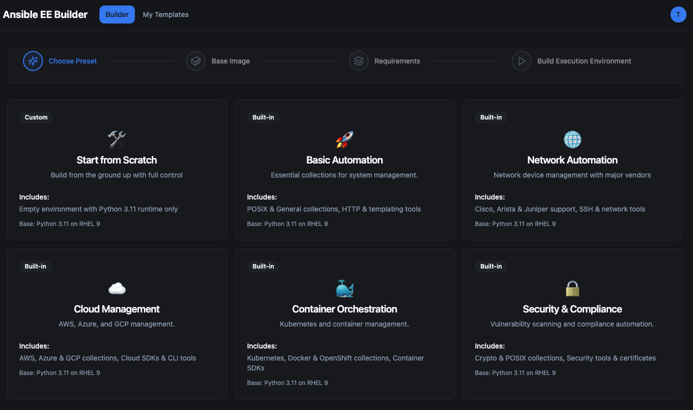

# Visual Ansible EE Builder 

Visual builder for Ansible Execution Environments. Create an EE freaky fast — without fighting YAML, dependencies, or base-image gotchas.




## 🚀 What it does
- Start from **EE presets** (Basic, Network, Cloud, Security) or from scratch.
- Pick a **base image**, add **collections / Python packages / RPMs**.
- [**Build in the cloud** ](https://www.visualeebuilder.com) or export a ready-to-build package.
- **Secure credential storage** for Red Hat and registry authentication.
- Save and reuse your own presets.  

## 🧩 Presets
Presets give you a **known working** execution environment & dependencies. Use them as-is or tweak them.

- **Basic Automation** → minimal setup for running playbooks (posix + requests + openssh-clients).  
- **Network Automation** → SSH/NETCONF ready (ansible.netcommon, netmiko, paramiko, ncclient).  
- **Cloud Automation** → lightweight cloud SDKs (azure, boto3, google-auth).
- **Container Orchestration** → Kubernetes, Docker & OpenShift collections, Container SDKs.  
- **Security & Compliance** → crypto + hardening (community.crypto, devsec.hardening, cryptography).  

## 🧱 Base images (built-in lineup)

1. **UBI Python 3.11 (recommended)** — `registry.access.redhat.com/ubi9/python-311`  
   *Free, RHEL-like, Python preinstalled → smoothest builds.*  

2. **AAP EE Minimal (requires entitlement)** — `registry.redhat.io/ansible-automation-platform-25/ee-minimal-rhel9:latest`  
   *Official AAP base. Requires `podman login registry.redhat.io` on the build machine.*  

3. **Custom** — any `<registry>/<namespace>/<name>:<tag>`  
   *If not RHEL/UBI-like, RPM installs may fail due to missing package managers.*  

## ⏱️ Quick Start
1. Pick a base image (or preset).  
2. Add collections / Python deps / RPMs.  
3. **Choose your build method:**
   - **Cloud Build**: We'll build and push for you (requires registry credentials)
   - **Local Build**: Export the build package & create your EE locally


## ☁️ Cloud Builds
Skip the local setup and let us build your EE for you:

- **5 free builds** included with every account
- **Additional builds** available for $3 (10 builds)
- **Automatic registry push** to your specified registry
- **Secure credential storage** for Red Hat and registry authentication
- **Real-time build logs** and progress tracking

## 📦 Files you'll get
```
execution-environment.yml
requirements.yml
requirements.txt
bindep.txt    # only if you added RPMs
build.sh      # build script to run
```

## 🧪 Troubleshooting
- **`registry.redhat.io` pull fails** → run `podman login registry.redhat.io`.  
- **Missing Python at build** → use **UBI Python 3.11** base or install Python in your Containerfile.  
- **`dnf` vs `microdnf`** → UBI minimal uses `microdnf`; standard UBI/AAP use `dnf`.  
- **Custom base quirks** → non‑RHEL bases may not support RPM installs.

## 🔐 Security & Privacy
- **Credential storage**: Red Hat and registry credentials are encrypted and stored securely
- **Client-side generation**: Files are generated client-side and downloaded to your machine
- **Secure cloud builds**: Cloud builds use encrypted credentials and are processed securely
